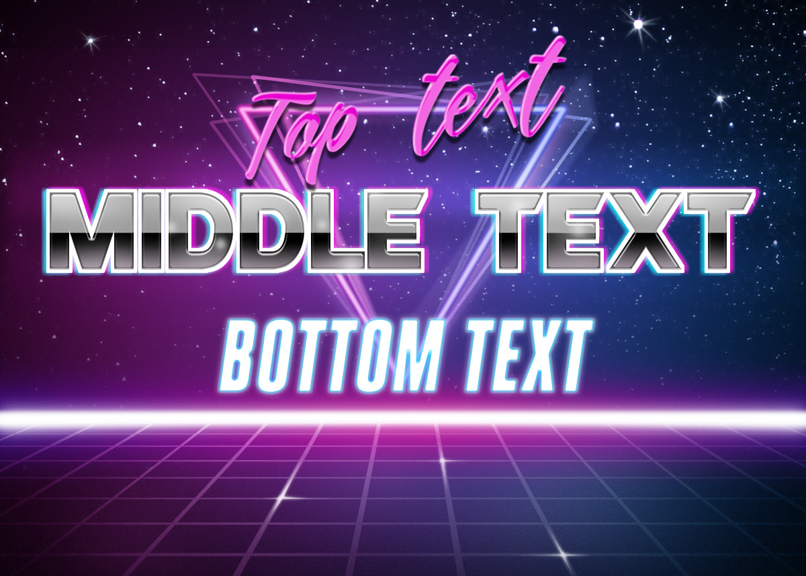

# lita-retrotext

This plugin allows you to create text images from the retro-wave effect found on [photofunia](https://photofunia.com/effects/retro-wave?redirect=false).

## Installation

Add lita-retrotext to your Lita instance's Gemfile:

``` bash
gem "lita-retrotext"
```

## Configuration

There is no special configuration

## Usage

To use, simply run the command:

```
[BOT_NAME] retro Top_text Middle_text Bottom_text
```

And the bot will generate an image like the following:

